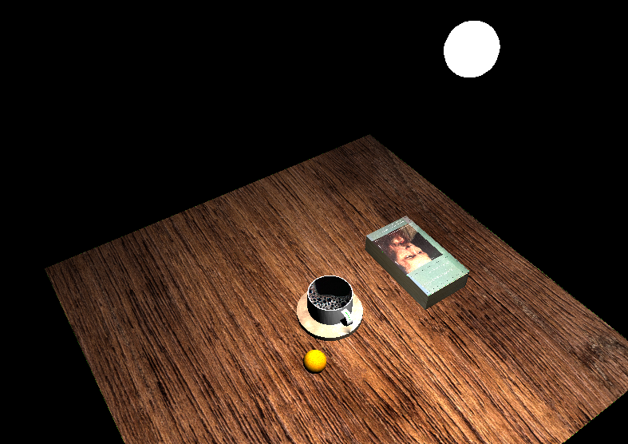

# CS330-CompGraphics-SNHU

What I took away from this course.

I can basically build a graphical web or desktop application that is independent of a graphics engine such as Unity. Graphics engines today generally are using up to date graphics API's such as Vulkan, DirectX, and Metal. Where as I have used OpenGL, a more legacy API that deals with the graphical rendering. Despite using a legacy API, I am confident in continuing my education in graphical programming, and developing more advanced features in OpenGL as well as learning other more advanced graphic API's. My application directly targets Windows desktop as OpenGL is interacting with the Windows Win32 API, and I used C++ to build out the scene. WebGL targets the web, which is accessible to the internet and it uses JavaScript as the programming language. I am used to JavaScript and replicating the scene to WebGL is doable on my end. 

The code design was straight forward. There is a lot of boilerplate code going on that handles the functionality in the background. UInitialize function assigns a version to GLFW, and other important processes to the application. Thus, only a small section of the source.cpp file is used to develop the graphical scene for the users to view. The function. Thus, the function URender is what determines the characteristics of the light, what shape is the light source, as well as all the other shapes. The texture is loaded in the main function, but its still URender that determines which texture is assigned to a object. URender plays an important part with interacting with the shaders. The shaders uses the C programming language to interact with the GPU or the CPU's built in GPU, so that the GPU understands what to render to the screen. It is possible that as the application became more complex with different scenes, that it would be better if URender were to use classes and functions to make the code easier to understand.  

